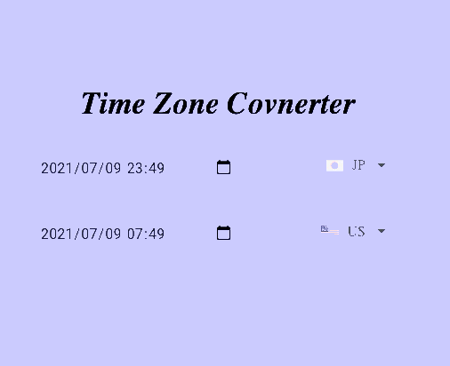

# Time Zone Converter

Time Zone Converter is used to convert the time in Japan to the time in the United States.

# demo

Try the demo [here!](https://time-zone-converter-3a99a.firebaseapp.com/)

## Installation

# Usage
